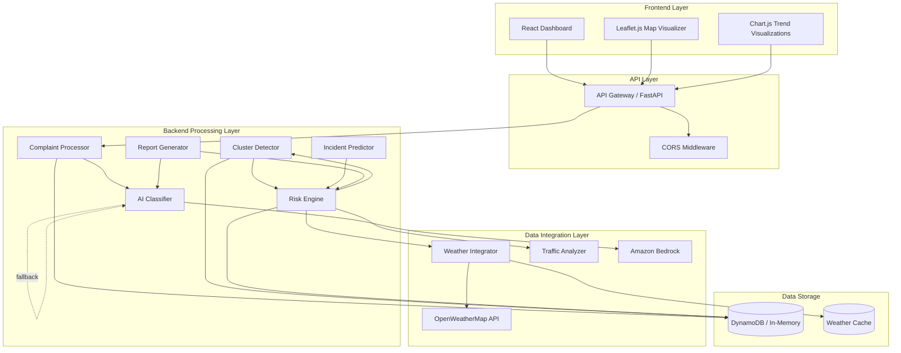

# Design Document: UrbanGuard AI System

## Overview

UrbanGuard AI is an urban infrastructure risk prediction platform that transforms fragmented citizen complaints into actionable insights for city authorities. The system combines AI-powered complaint classification with contextual signals (weather and traffic data) to identify high-risk zones and predict potential incidents before they escalate.

The platform consists of three primary layers:

1. **Backend Processing Layer**: Python FastAPI application handling complaint ingestion, AI classification, risk calculation, and cluster detection
2. **AI & Data Integration Layer**: Amazon Bedrock integration for intelligent classification with keyword fallback, plus OpenWeatherMap API and simulated traffic data integration
3. **Frontend Visualization Layer**: React dashboard with Leaflet.js interactive maps and Chart.js trend visualizations

The system is designed for both local development and AWS serverless deployment, supporting automatic scaling through Lambda functions, API Gateway, and DynamoDB.

### Key Design Principles

- **Resilience**: Graceful degradation with fallback mechanisms (keyword classification when Bedrock unavailable, cached weather data)
- **Real-time responsiveness**: Sub-second API responses with periodic background recalculation (15-minute risk score updates)
- **Scalability**: Stateless API design compatible with serverless architecture
- **Observability**: Comprehensive logging and error handling for operational visibility

## Architecture

### System Architecture Diagram



### Component Interaction Flow

**Complaint Submission Flow:**
1. Citizen submits complaint via React UI
2. API Gateway routes to Complaint_Processor
3. Complaint_Processor validates location and category
4. AI_Classifier attempts Bedrock classification, falls back to keywords if needed
5. Validated complaint stored in DynamoDB
6. Confirmation returned to UI within 500ms

**Risk Calculation Flow (every 15 minutes):**
1. Cluster_Detector groups complaints within 500m radius
2. Weather_Integrator fetches current conditions from OpenWeatherMap
3. Traffic_Analyzer provides congestion levels for each location
4. Risk_Engine calculates scores using: complaint density + weather factors + traffic factors
5. Incident_Predictor generates predictions for zones with Risk_Score > 70
6. Updated risk zones pushed to frontend via polling

**Dashboard Visualization Flow:**
1. Frontend polls Dashboard_API every 30 seconds
2. Map_Visualizer renders risk zones with color coding (green/yellow/red)
3. Complaint feed displays 20 most recent submissions
4. Chart.js renders 7-day trend data
5. Weather and traffic panels update at their respective intervals

### Deployment Architecture

**Local Development:**
- Backend: FastAPI on port 8000 with Uvicorn hot-reload
- Frontend: React dev server on port 3000
- Storage: In-memory data structures with 40+ simulated complaints
- External APIs: OpenWeatherMap (real), Traffic (simulated)

**AWS Serverless Production:**
- Backend: Lambda functions behind API Gateway
- Storage: DynamoDB tables for complaints, risk zones, reports
- AI: Amazon Bedrock runtime API
- Monitoring: CloudWatch logs for all components
- Cold start optimization: Keep-warm ping for critical functions

## Components and Interfaces

### Backend Components

#### Complaint_Processor

**Responsibility**: Validate and store citizen complaints

**Interface:**
```python
class ComplaintProcessor:
    def submit_complaint(
        self,
        location: str,
        category: str,
        description: str,
        timestamp: datetime
    ) -> ComplaintResult:
        """
        Validates and stores a citizen complaint.
        
        Args:
            location: Must match predefined Bengaluru_Location
            category: One of 8 supported types
            description: Free-text complaint details
            timestamp: Submission time
            
        Returns:
            ComplaintResult with success status and complaint_id or error message
            
        Performance:
            - Invalid data: < 100ms response
            - Valid data: < 500ms response including storage
        """
        pass
    
    def get_all_complaints(self) -> List[Complaint]:
        """
        Retrieves all complaints sorted by timestamp descending.
        
        Returns:
            List of complaints with coordinates for map visualization
            
        Performance:
            - < 200ms for up to 1000 complaints
        """
        pass
```

**Validation Rules:**
- Location: Must exist in predefined 40+ Bengaluru locations
- Category: Must be one of: pothole, flooding, traffic, garbage, streetlight, water_supply, noise, construction
- Description: Non-empty string
- Timestamp: Valid datetime

#### AI_Classifier

**Responsibility**: Categorize complaints using AI or keyword fallback

**Interface:**
```python
class AIClassifier:
    def classify_complaint(
        self,
        description: str,
        location: str
    ) -> ClassificationResult:
        """
        Classifies complaint using Amazon Bedrock or keyword fallback.
        
        Args:
            description: Complaint text
            location: Location context for classification
            
        Returns:
            ClassificationResult with single category and confidence score
            
        Performance:
            - < 3 seconds total (including Bedrock API call)
            
        Accuracy:
            - Target: 85% on test data
        """
        pass
    
    def _bedrock_classify(self, description: str) -> Optional[str]:
        """Attempts classification via Amazon Bedrock"""
        pass
    
    def _keyword_classify(self, description: str) -> str:
        """Fallback keyword-based classification"""
        pass
```

**Classification Strategy:**
- Primary: Amazon Bedrock with prompt engineering for 8 categories
- Fallback: Keyword matching (e.g., "pothole" → pothole, "flood" → flooding)
- Always returns exactly one category

#### Cluster_Detector

**Responsibility**: Identify geographic complaint clusters

**Interface:**
```python
class ClusterDetector:
    def detect_clusters(
        self,
        complaints: List[Complaint],
        time_window_hours: int = 24
    ) -> List[Cluster]:
        """
        Groups complaints within 500m radius.
        
        Args:
            complaints: All complaints to analyze
            time_window_hours: Time window for clustering (default 24h)
            
        Returns:
            List of clusters with density calculations
            
        Logic:
            - Group complaints within 500m of each other
            - Calculate density per square kilometer
            - Flag clusters with 5+ complaints in 24h as high-density
            
        Execution:
            - Runs every 15 minutes via background scheduler
        """
        pass
    
    def calculate_density(self, cluster: Cluster) -> float:
        """Calculates complaints per square kilometer"""
        pass
```

**Clustering Algorithm:**
- Distance metric: Haversine formula for geographic coordinates
- Radius: 500 meters
- High-density threshold: 5+ complaints within 24 hours
- Update frequency: Every 15 minutes

#### Risk_Engine

**Responsibility**: Calculate risk scores for urban zones

**Interface:**
```python
class RiskEngine:
    def calculate_risk_score(
        self,
        zone: Zone,
        complaints: List[Complaint],
        weather: WeatherData,
        traffic: TrafficData
    ) -> RiskScore:
        """
        Calculates risk score (0-100) for a zone.
        
        Args:
            zone: Geographic zone to analyze
            complaints: Complaints in the zone
            weather: Current weather conditions
            traffic: Current traffic congestion
            
        Returns:
            RiskScore with value 0-100 and risk level classification
            
        Scoring Logic:
            - Base: Complaint density (5+ per km² → +20 points)
            - Weather: High rainfall (>10mm/hr) → +30 points for flood-related
            - Traffic: High congestion → +15 points for traffic-related
            
        Execution:
            - Recalculates all zones every 15 minutes
        """
        pass
    
    def classify_risk_level(self, score: float) -> RiskLevel:
        """
        Classifies risk level based on score.
        
        Returns:
            - LOW: 0-33
            - MEDIUM: 34-66
            - HIGH: 67-100
        """
        pass
```

**Risk Calculation Formula:**
```
risk_score = base_score + weather_modifier + traffic_modifier

where:
  base_score = (complaint_density > 5) ? 20 : (complaint_density * 4)
  weather_modifier = (rainfall > 10mm/hr AND flood_complaints) ? 30 : 0
  traffic_modifier = (congestion == HIGH AND traffic_complaints) ? 15 : 0
  
  capped at 100
```

#### Incident_Predictor

**Responsibility**: Forecast potential urban incidents

**Interface:**
```python
class IncidentPredictor:
    def predict_incidents(
        self,
        risk_zones: List[RiskZone]
    ) -> List[IncidentPrediction]:
        """
        Generates incident predictions for high-risk zones.
        
        Args:
            risk_zones: Zones with calculated risk scores
            
        Returns:
            List of incident predictions with type and time window
            
        Logic:
            - Only predict for zones with Risk_Score > 70
            - Incident type based on dominant complaint category
            - Special rules:
              * High rainfall + flooding complaints → flooding incident
              * High traffic + traffic complaints → gridlock incident
            - Time windows: next 6 hours or next 24 hours
        """
        pass
    
    def determine_time_window(self, risk_score: float) -> str:
        """
        Determines prediction time window.
        
        Returns:
            - "next 6 hours" for risk_score > 85
            - "next 24 hours" for risk_score 70-85
        """
        pass
```

#### Report_Generator

**Responsibility**: Create daily AI-generated risk reports

**Interface:**
```python
class ReportGenerator:
    def generate_daily_report(
        self,
        date: datetime
    ) -> DailyReport:
        """
        Creates daily report at 06:00 local time.
        
        Args:
            date: Report date
            
        Returns:
            DailyReport with statistics and AI-generated summary
            
        Content:
            - Total complaints count
            - High-risk zones list
            - Predicted incidents
            - Weather summary
            - AI-generated natural language risk pattern analysis
            
        Storage:
            - Retained for 30 days
        """
        pass
    
    def get_latest_report(self) -> DailyReport:
        """
        Retrieves most recent report.
        
        Performance:
            - < 200ms response time
        """
        pass
```

#### Weather_Integrator

**Responsibility**: Retrieve and process weather data

**Interface:**
```python
class WeatherIntegrator:
    def fetch_weather_data(self) -> WeatherData:
        """
        Retrieves current weather from OpenWeatherMap API.
        
        Returns:
            WeatherData with temperature, humidity, precipitation, wind speed
            
        Behavior:
            - Fetches every 30 minutes
            - Falls back to cached data if API unavailable
            - Logs warning on API failure
            - Flags high rainfall when precipitation > 10mm/hr
            
        Performance:
            - < 100ms to provide data from cache/memory
        """
        pass
    
    def is_high_rainfall(self, weather: WeatherData) -> bool:
        """Returns True if precipitation > 10mm/hr"""
        pass
```

#### Traffic_Analyzer

**Responsibility**: Process traffic congestion data

**Interface:**
```python
class TrafficAnalyzer:
    def get_traffic_data(self, location: str) -> TrafficData:
        """
        Provides traffic congestion level for a location.
        
        Args:
            location: Bengaluru_Location identifier
            
        Returns:
            TrafficData with congestion level and score
            
        Scoring:
            - LOW: score = 1
            - MEDIUM: score = 5
            - HIGH: score = 10
            
        Updates:
            - Refreshes every 10 minutes
            
        Performance:
            - < 50ms response time
        """
        pass
    
    def update_traffic_data(self):
        """Updates traffic data for all locations (simulated)"""
        pass
```

### Frontend Components

#### Map_Visualizer

**Responsibility**: Interactive map display with risk zones

**Interface:**
```typescript
interface MapVisualizerProps {
  riskZones: RiskZone[];
  complaints: Complaint[];
  updateInterval: number; // 30 seconds
}

class MapVisualizer extends React.Component {
  /**
   * Renders Bengaluru map using Leaflet.js
   * 
   * Features:
   * - Color-coded risk zones (green/yellow/red)
   * - Complaint markers with popup details
   * - Click handlers for zone details
   * - Auto-refresh every 30 seconds
   */
  
  renderRiskZones(): void {
    // Green: risk_score 0-33
    // Yellow: risk_score 34-66
    // Red: risk_score 67-100
  }
  
  renderComplaintMarkers(): void {
    // Display complaint locations as map markers
  }
  
  handleZoneClick(zone: RiskZone): void {
    // Show zone details: risk_score, complaint count, predictions
  }
}
```

#### Dashboard Components

**ComplaintFeed:**
```typescript
interface ComplaintFeedProps {
  complaints: Complaint[];
  maxDisplay: number; // 20
}

// Displays 20 most recent complaints
// Auto-scrolls to show new arrivals within 5 seconds
// Shows: location, category, description, timestamp
```

**TrendCharts:**
```typescript
interface TrendChartsProps {
  historicalData: HistoricalData;
  updateInterval: number; // 5 minutes
}

// Chart.js visualizations:
// - Complaint volume trends (7 days)
// - Risk score trends for top 5 high-risk zones
```

**WeatherPanel:**
```typescript
interface WeatherPanelProps {
  weather: WeatherData;
  updateInterval: number; // 30 minutes
}

// Displays: temperature, humidity, precipitation, wind speed
// Highlights panel in red when high rainfall detected
// Shows weather icons for current conditions
```

**TrafficPanel:**
```typescript
interface TrafficPanelProps {
  trafficData: TrafficData[];
  updateInterval: number; // 10 minutes
}

// Displays traffic for 10+ key locations
// Color coding: green (low), yellow (medium), red (high)
```

### API Endpoints (Dashboard_API)

```python
# Complaint Management
POST /report-complaint
  Request: {location, category, description, timestamp}
  Response: {success, complaint_id, message}
  Performance: < 500ms

GET /complaints
  Response: [{complaint_id, location, category, description, timestamp, coordinates}]
  Performance: < 200ms for 1000 complaints
  Sorting: timestamp DESC

# Risk Analysis
GET /risk-hotspots
  Response: [{zone_id, coordinates, risk_score, risk_level, complaint_count}]
  Filter: risk_score > 20
  Performance: < 300ms

# Reports
GET /daily-report
  Response: {date, total_complaints, high_risk_zones, predictions, weather_summary, ai_summary}
  Performance: < 200ms

# Contextual Data
GET /weather
  Response: {temperature, humidity, precipitation, wind_speed, high_rainfall_flag}
  Performance: < 100ms

GET /traffic
  Response: [{location, congestion_level, congestion_score}]
  Performance: < 100ms

# CORS Configuration
- Allow origin: http://localhost:3000 (development)
- Allow methods: GET, POST, OPTIONS
- Allow headers: Content-Type, Authorization
```

## Data Models

### Core Data Structures

#### Complaint
```python
@dataclass
class Complaint:
    complaint_id: str  # UUID
    location: str  # Must match Bengaluru_Location
    category: str  # One of 8 supported categories
    description: str
    timestamp: datetime
    coordinates: Tuple[float, float]  # (latitude, longitude)
    classification_confidence: float  # 0.0 - 1.0
    
    # Supported categories
    CATEGORIES = [
        "pothole",
        "flooding",
        "traffic",
        "garbage",
        "streetlight",
        "water_supply",
        "noise",
        "construction"
    ]
```

#### RiskZone
```python
@dataclass
class RiskZone:
    zone_id: str
    center_coordinates: Tuple[float, float]
    radius_meters: float  # 500m for clustering
    risk_score: float  # 0-100
    risk_level: RiskLevel  # LOW, MEDIUM, HIGH
    complaint_count: int
    dominant_category: str
    last_updated: datetime
    
class RiskLevel(Enum):
    LOW = "low"  # 0-33
    MEDIUM = "medium"  # 34-66
    HIGH = "high"  # 67-100
```

#### WeatherData
```python
@dataclass
class WeatherData:
    temperature_celsius: float
    humidity_percent: float
    precipitation_mm_per_hour: float
    wind_speed_kmh: float
    high_rainfall_flag: bool  # True if precipitation > 10mm/hr
    timestamp: datetime
    source: str  # "openweathermap" or "cache"
```

#### TrafficData
```python
@dataclass
class TrafficData:
    location: str
    congestion_level: CongestionLevel
    congestion_score: int  # 1, 5, or 10
    timestamp: datetime
    
class CongestionLevel(Enum):
    LOW = "low"  # score = 1
    MEDIUM = "medium"  # score = 5
    HIGH = "high"  # score = 10
```

#### IncidentPrediction
```python
@dataclass
class IncidentPrediction:
    prediction_id: str
    zone_id: str
    incident_type: str  # Based on dominant complaint category
    risk_score: float
    time_window: str  # "next 6 hours" or "next 24 hours"
    contributing_factors: List[str]  # e.g., ["high_rainfall", "complaint_density"]
    created_at: datetime
```

#### DailyReport
```python
@dataclass
class DailyReport:
    report_id: str
    date: datetime
    total_complaints: int
    high_risk_zones: List[RiskZone]
    predicted_incidents: List[IncidentPrediction]
    weather_summary: str
    ai_generated_summary: str  # Natural language risk pattern analysis
    created_at: datetime
```

#### Cluster
```python
@dataclass
class Cluster:
    cluster_id: str
    complaints: List[Complaint]
    center_coordinates: Tuple[float, float]
    radius_meters: float  # 500m
    density_per_km2: float
    is_high_density: bool  # True if 5+ complaints in 24h
    time_window_hours: int  # 24
```

### Database Schema (DynamoDB)

**Complaints Table:**
```
Primary Key: complaint_id (String)
Attributes:
  - location (String)
  - category (String)
  - description (String)
  - timestamp (Number - Unix timestamp)
  - coordinates (Map: {lat: Number, lon: Number})
  - classification_confidence (Number)

GSI: timestamp-index
  - Partition Key: category
  - Sort Key: timestamp
  - For efficient time-based queries
```

**RiskZones Table:**
```
Primary Key: zone_id (String)
Attributes:
  - center_coordinates (Map: {lat: Number, lon: Number})
  - risk_score (Number)
  - risk_level (String)
  - complaint_count (Number)
  - dominant_category (String)
  - last_updated (Number - Unix timestamp)

GSI: risk-score-index
  - Partition Key: risk_level
  - Sort Key: risk_score
  - For filtering high-risk zones
```

**DailyReports Table:**
```
Primary Key: report_id (String)
Sort Key: date (Number - Unix timestamp)
Attributes:
  - total_complaints (Number)
  - high_risk_zones (List)
  - predicted_incidents (List)
  - weather_summary (String)
  - ai_generated_summary (String)
  - created_at (Number)

TTL: 30 days from creation
```

### Bengaluru Location Reference

The system uses 40+ predefined locations with known coordinates:
```python
BENGALURU_LOCATIONS = {
    "Koramangala": (12.9352, 77.6245),
    "Indiranagar": (12.9716, 77.6412),
    "Whitefield": (12.9698, 77.7499),
    "Electronic City": (12.8456, 77.6603),
    "Jayanagar": (12.9250, 77.5838),
    "Malleshwaram": (13.0039, 77.5727),
    "HSR Layout": (12.9116, 77.6473),
    "BTM Layout": (12.9166, 77.6101),
    # ... 32+ more locations
}
```


## Correctness Properties

A property is a characteristic or behavior that should hold true across all valid executions of a system—essentially, a formal statement about what the system should do. Properties serve as the bridge between human-readable specifications and machine-verifiable correctness guarantees.

### Property 1: Complaint Structure Acceptance

For any complaint containing location, category, description, and timestamp fields, the Complaint_Processor should accept and process it (assuming valid values).

**Validates: Requirements 1.1**

### Property 2: Location Validation

For any submitted complaint, if the location is not in the predefined Bengaluru_Location set, the Complaint_Processor should reject it with an error message.

**Validates: Requirements 1.2**

### Property 3: Category Validation

For any submitted complaint, if the category is not one of the 8 supported types (pothole, flooding, traffic, garbage, streetlight, water_supply, noise, construction), the Complaint_Processor should reject it with an error message.

**Validates: Requirements 1.3**

### Property 4: Invalid Complaint Error Response

For any complaint with invalid data (invalid location, invalid category, or missing required fields), the Complaint_Processor should return a descriptive error message.

**Validates: Requirements 1.4**

### Property 5: Valid Complaint Storage Round-Trip

For any valid complaint, if it is submitted to the Complaint_Processor, then retrieving all complaints should include that complaint with matching data.

**Validates: Requirements 1.5**

### Property 6: AI Classification Attempts Bedrock First

For any complaint received, the AI_Classifier should attempt classification using Amazon Bedrock before falling back to keyword-based classification.

**Validates: Requirements 2.1**

### Property 7: Classification Fallback on Bedrock Failure

For any complaint, if Amazon Bedrock is unavailable or returns an error, the AI_Classifier should use keyword-based fallback classification and still return a valid category.

**Validates: Requirements 2.2**

### Property 8: Single Category Assignment

For any complaint processed by the AI_Classifier, exactly one category should be assigned (no more, no less).

**Validates: Requirements 2.3**

### Property 9: Complaint Retrieval Sorting

For any set of complaints retrieved from the Dashboard_API, they should be sorted by timestamp in descending order (most recent first).

**Validates: Requirements 3.2**

### Property 10: Complaint Response Completeness

For any complaint returned by the Dashboard_API, it should include location coordinates along with all other complaint fields.

**Validates: Requirements 3.4**

### Property 11: Geographic Clustering

For any set of complaints, those within 500 meters of each other should be grouped into the same cluster by the Cluster_Detector.

**Validates: Requirements 4.1**

### Property 12: Density Calculation Correctness

For any cluster, the calculated density (complaints per square kilometer) should accurately reflect the number of complaints divided by the cluster area.

**Validates: Requirements 4.2**

### Property 13: High-Density Cluster Flagging

For any zone, if it contains 5 or more complaints within a 24-hour time window, the Cluster_Detector should flag it as a high-density cluster.

**Validates: Requirements 4.3**

### Property 14: Weather Data Extraction Completeness

For any weather data retrieved from the OpenWeatherMap API, the Weather_Integrator should extract and provide temperature, humidity, precipitation, and wind speed.

**Validates: Requirements 5.2**

### Property 15: Weather Data Fallback on API Failure

For any request for weather data, if the OpenWeatherMap API is unavailable, the Weather_Integrator should return cached data and log a warning (rather than failing).

**Validates: Requirements 5.3**

### Property 16: High Rainfall Flagging

For any weather data, if precipitation exceeds 10mm per hour, the Weather_Integrator should set the high_rainfall_flag to true.

**Validates: Requirements 5.5**

### Property 17: Traffic Congestion Processing

For any Bengaluru_Location, the Traffic_Analyzer should process and provide traffic congestion level (low, medium, or high).

**Validates: Requirements 6.1**

### Property 18: Congestion Score Mapping

For any traffic data, the Traffic_Analyzer should assign congestion scores according to the mapping: low=1, medium=5, high=10.

**Validates: Requirements 6.3**

### Property 19: Risk Score Calculation Uses All Factors

For any zone, the Risk_Engine should calculate the Risk_Score using complaint density, weather conditions, and traffic congestion (all three factors should influence the score).

**Validates: Requirements 7.1**

### Property 20: Risk Score Bounds

For any zone, the Risk_Engine should produce a Risk_Score value between 0 and 100 (inclusive).

**Validates: Requirements 7.2**

### Property 21: High Complaint Density Score Increase

For any zone, if complaint density exceeds 5 complaints per square kilometer, the Risk_Engine should increase the Risk_Score by at least 20 points compared to a zone with lower density (all other factors equal).

**Validates: Requirements 7.3**

### Property 22: High Rainfall Flood Risk Increase

For any zone with flood-related complaints, if high rainfall conditions are detected, the Risk_Engine should increase the Risk_Score by at least 30 points compared to the same zone without high rainfall.

**Validates: Requirements 7.4**

### Property 23: High Traffic Congestion Risk Increase

For any zone with traffic-related complaints, if traffic congestion is high, the Risk_Engine should increase the Risk_Score by at least 15 points compared to the same zone with low traffic.

**Validates: Requirements 7.5**

### Property 24: Risk Level Classification

For any Risk_Score value, the Risk_Engine should classify it as: low-risk (0-33), medium-risk (34-66), or high-risk (67-100).

**Validates: Requirements 8.1**

### Property 25: Risk Zone Filtering

For any request for risk zones, the Dashboard_API should return only zones with Risk_Score above 20.

**Validates: Requirements 8.2**

### Property 26: Risk Zone Response Completeness

For any risk zone returned by the Dashboard_API, it should include zone coordinates, Risk_Score, and risk level.

**Validates: Requirements 8.3**

### Property 27: Incident Prediction for High-Risk Zones

For any zone with Risk_Score above 70, the Incident_Predictor should generate an incident prediction.

**Validates: Requirements 9.1**

### Property 28: Incident Type Matches Dominant Category

For any zone with an incident prediction, the incident type should match the dominant complaint category in that zone.

**Validates: Requirements 9.2**

### Property 29: Flooding Incident Prediction

For any zone, if high rainfall conditions and flooding complaints coincide, the Incident_Predictor should predict a flooding incident.

**Validates: Requirements 9.3**

### Property 30: Traffic Gridlock Prediction

For any zone, if high traffic congestion and traffic complaints coincide, the Incident_Predictor should predict a traffic gridlock incident.

**Validates: Requirements 9.4**

### Property 31: Incident Prediction Time Window Inclusion

For any incident prediction, it should include a predicted time window (either "next 6 hours" or "next 24 hours").

**Validates: Requirements 9.5**

### Property 32: Daily Report Completeness

For any daily report generated, it should include total complaints count, high-risk zones list, predicted incidents, and weather summary.

**Validates: Requirements 10.2**

### Property 33: AI Summary Generation

For any daily report, the Report_Generator should use AI to generate a natural language summary of risk patterns (the summary should be non-empty and generated via AI).

**Validates: Requirements 10.3**

### Property 34: Risk Zone Color Coding

For any risk zone displayed, the Map_Visualizer should apply color coding based on risk level: green for low-risk (0-33), yellow for medium-risk (34-66), red for high-risk (67-100).

**Validates: Requirements 11.2**

### Property 35: Complaint Marker Display

For any complaint in the system, the Map_Visualizer should display it as a marker on the map at its coordinate location.

**Validates: Requirements 11.4**

### Property 36: Recent Complaints Feed Selection

For any set of complaints, the Map_Visualizer should display the 20 most recent complaints in chronological order (most recent first).

**Validates: Requirements 13.1**

### Property 37: Complaint Feed Display Completeness

For any complaint displayed in the feed, the Map_Visualizer should show location, category, description, and timestamp.

**Validates: Requirements 13.3**

### Property 38: Seven-Day Complaint Volume Trend

For any set of complaints, the Map_Visualizer should calculate and display complaint volume trends for the past 7 days.

**Validates: Requirements 14.2**

### Property 39: Top Five Risk Zone Trends

For any set of risk zones, the Map_Visualizer should identify the top 5 high-risk zones and display their Risk_Score trends.

**Validates: Requirements 14.3**

### Property 40: Weather Display Completeness

For any weather data, the Map_Visualizer should display temperature, humidity, precipitation, and wind speed.

**Validates: Requirements 15.1**

### Property 41: High Rainfall Weather Panel Highlighting

For any weather data, if high rainfall conditions are detected, the Map_Visualizer should highlight the weather panel in red.

**Validates: Requirements 15.3**

### Property 42: Weather Icon Selection

For any weather condition, the Map_Visualizer should display a weather icon corresponding to the current conditions.

**Validates: Requirements 15.4**

### Property 43: Traffic Location Display

For any set of traffic data, the Map_Visualizer should display traffic congestion levels for major Bengaluru_Location areas.

**Validates: Requirements 16.1**

### Property 44: Traffic Congestion Color Coding

For any traffic congestion level displayed, the Map_Visualizer should use color coding: green for low, yellow for medium, red for high.

**Validates: Requirements 16.2**

### Property 45: API JSON Response Format

For any API endpoint call, the Dashboard_API should return a JSON response with an appropriate HTTP status code.

**Validates: Requirements 17.7**

### Property 46: Error Logging Completeness

For any error that occurs in any component, the component should log the error with timestamp, component name, and error details.

**Validates: Requirements 20.1**

### Property 47: External API Retry Behavior

For any external API call that fails, the component should retry up to 3 times with exponential backoff before giving up.

**Validates: Requirements 20.2**

### Property 48: Graceful Error Response After Retries

For any external API call, if all 3 retries fail, the component should return a graceful error response to the user (not crash or hang).

**Validates: Requirements 20.3**

### Property 49: Request Logging Completeness

For any incoming request to the Dashboard_API, it should be logged with method, path, and response time.

**Validates: Requirements 20.4**

### Property 50: Error Response Format

For any error condition, the Dashboard_API should return an error response with an appropriate HTTP status code and a descriptive error message.

**Validates: Requirements 20.5**

## Error Handling

### Error Categories and Handling Strategies

**1. Input Validation Errors**
- Invalid location: Return 400 Bad Request with message "Invalid location: {location} not found in Bengaluru locations"
- Invalid category: Return 400 Bad Request with message "Invalid category: {category}. Must be one of: pothole, flooding, traffic, garbage, streetlight, water_supply, noise, construction"
- Missing required fields: Return 400 Bad Request with message "Missing required field: {field_name}"
- Response time: < 100ms

**2. External API Failures**
- Amazon Bedrock unavailable: Fall back to keyword-based classification, log warning
- OpenWeatherMap API unavailable: Use cached weather data (up to 1 hour old), log warning
- Retry strategy: 3 attempts with exponential backoff (1s, 2s, 4s)
- After all retries fail: Return 503 Service Unavailable with message "External service temporarily unavailable"

**3. Database Errors**
- DynamoDB write failure: Retry 3 times, then return 500 Internal Server Error
- DynamoDB read failure: Retry 3 times, then return 500 Internal Server Error
- Connection timeout: 5 seconds, then retry

**4. AI Classification Errors**
- Bedrock timeout (> 3 seconds): Fall back to keyword classification
- Bedrock invalid response: Fall back to keyword classification
- Keyword classification always succeeds (uses default category if no keywords match)

**5. Risk Calculation Errors**
- Missing weather data: Use default values (temperature: 25°C, humidity: 60%, precipitation: 0mm/hr, wind: 10km/h)
- Missing traffic data: Use default congestion level (MEDIUM, score: 5)
- Invalid coordinates: Skip the complaint in clustering, log error

**6. Frontend Errors**
- API request timeout (> 10 seconds): Display error message to user, retry after 30 seconds
- Map rendering failure: Display error message, fall back to list view
- Chart rendering failure: Display error message, hide chart component

### Logging Strategy

**Log Levels:**
- ERROR: System errors, external API failures after retries, database errors
- WARN: External API failures (before retries), fallback activations, missing optional data
- INFO: Incoming requests, successful operations, scheduled task execution
- DEBUG: Detailed operation flow, intermediate calculations

**Log Format:**
```json
{
  "timestamp": "2024-01-15T10:30:45.123Z",
  "level": "ERROR",
  "component": "AI_Classifier",
  "message": "Bedrock API call failed",
  "error_details": {
    "error_type": "TimeoutError",
    "error_message": "Request timeout after 3 seconds",
    "retry_count": 3
  },
  "context": {
    "complaint_id": "abc-123",
    "location": "Koramangala"
  }
}
```

**Log Retention:**
- Local development: Console output only
- AWS production: CloudWatch Logs with 30-day retention

### Circuit Breaker Pattern

For external API calls (Bedrock, OpenWeatherMap):
- Open circuit after 5 consecutive failures
- Half-open after 60 seconds (allow 1 test request)
- Close circuit after 3 consecutive successes
- While open: Immediately use fallback without attempting API call

## Testing Strategy

### Dual Testing Approach

The UrbanGuard AI system requires both unit testing and property-based testing to ensure comprehensive correctness:

**Unit Tests** focus on:
- Specific examples demonstrating correct behavior
- Edge cases (empty inputs, boundary values, extreme conditions)
- Error conditions and exception handling
- Integration points between components
- API endpoint existence and basic functionality

**Property-Based Tests** focus on:
- Universal properties that hold for all inputs
- Comprehensive input coverage through randomization
- Invariants that must be maintained
- Round-trip properties (serialization, classification)
- Relationship properties between components

Together, these approaches provide comprehensive coverage: unit tests catch concrete bugs and verify specific scenarios, while property tests verify general correctness across the input space.

### Property-Based Testing Configuration

**Framework Selection:**
- Python backend: Hypothesis (https://hypothesis.readthedocs.io/)
- TypeScript/JavaScript frontend: fast-check (https://fast-check.dev/)

**Test Configuration:**
- Minimum 100 iterations per property test (due to randomization)
- Seed-based reproducibility for failed tests
- Shrinking enabled to find minimal failing examples

**Property Test Tagging:**
Each property-based test must include a comment tag referencing the design document property:

```python
# Feature: urbanguard-ai-system, Property 2: Location Validation
@given(st.text())
def test_location_validation_rejects_invalid_locations(location):
    if location not in BENGALURU_LOCATIONS:
        result = complaint_processor.submit_complaint(
            location=location,
            category="pothole",
            description="Test",
            timestamp=datetime.now()
        )
        assert not result.success
        assert "Invalid location" in result.error_message
```

### Test Coverage by Component

**Complaint_Processor:**
- Unit tests: Valid complaint submission, specific invalid inputs (empty location, null category)
- Property tests: Properties 1-5 (structure acceptance, validation, round-trip)

**AI_Classifier:**
- Unit tests: Specific classification examples, Bedrock mock responses, keyword fallback examples
- Property tests: Properties 6-8 (Bedrock attempt, fallback, single category)

**Cluster_Detector:**
- Unit tests: Specific clustering scenarios (2 complaints 400m apart, 3 complaints in triangle)
- Property tests: Properties 11-13 (geographic clustering, density calculation, flagging)

**Risk_Engine:**
- Unit tests: Specific scoring scenarios, boundary values (score = 0, score = 100)
- Property tests: Properties 19-26 (calculation factors, bounds, scoring rules, classification, filtering)

**Incident_Predictor:**
- Unit tests: Specific prediction scenarios (flooding with rain, gridlock with traffic)
- Property tests: Properties 27-31 (high-risk prediction, type matching, special cases)

**Weather_Integrator:**
- Unit tests: OpenWeatherMap API mock responses, cache behavior
- Property tests: Properties 14-16 (extraction completeness, fallback, rainfall flagging)

**Traffic_Analyzer:**
- Unit tests: Specific traffic scenarios for known locations
- Property tests: Properties 17-18 (congestion processing, score mapping)

**Report_Generator:**
- Unit tests: Report generation with specific data, AI summary mock
- Property tests: Properties 32-33 (report completeness, AI summary generation)

**Dashboard_API:**
- Unit tests: Endpoint existence, CORS headers, specific request/response examples
- Property tests: Properties 9-10, 25-26, 45, 49-50 (sorting, completeness, JSON format, logging)

**Map_Visualizer (Frontend):**
- Unit tests: Component rendering with specific data, click handlers, color selection logic
- Property tests: Properties 34-44 (color coding, marker display, feed selection, trend calculation)

**Error Handling:**
- Unit tests: Specific error scenarios (Bedrock timeout, DynamoDB failure)
- Property tests: Properties 46-48 (logging completeness, retry behavior, graceful errors)

### Integration Testing

Beyond unit and property tests, integration tests should verify:
- End-to-end complaint submission flow (UI → API → Database → AI → Storage)
- Risk calculation pipeline (Complaints → Clustering → Weather → Traffic → Risk Score)
- Real-time dashboard updates (Backend changes → API polling → Frontend rendering)
- AWS Lambda deployment (Cold starts, API Gateway integration, DynamoDB operations)

### Performance Testing

Performance requirements should be validated through dedicated performance tests:
- API response times (< 100ms, < 200ms, < 300ms, < 500ms per requirement)
- Concurrent user load (100 concurrent users)
- Large dataset handling (1000+ complaints)
- Lambda cold start times (< 3 seconds)

### Test Data Generation

**For Property-Based Tests:**
- Complaints: Random location (from Bengaluru set), random category (from 8 types), random description (text), random timestamp
- Coordinates: Random lat/lon within Bengaluru bounds (12.8-13.2°N, 77.4-77.8°E)
- Weather data: Random temperature (15-40°C), humidity (20-100%), precipitation (0-50mm/hr), wind (0-60km/h)
- Traffic data: Random congestion level (LOW, MEDIUM, HIGH) for each location
- Risk scores: Random values 0-100

**For Unit Tests:**
- Predefined realistic complaints for Bengaluru locations
- Known clustering scenarios with calculated distances
- Specific weather conditions (heavy rain, normal, drought)
- Specific traffic patterns (rush hour, normal, late night)

### Continuous Integration

All tests should run on:
- Every commit (unit tests, property tests with 100 iterations)
- Pull requests (full test suite + integration tests)
- Nightly builds (extended property tests with 1000 iterations, performance tests)

Test failures should block deployment and trigger alerts.

